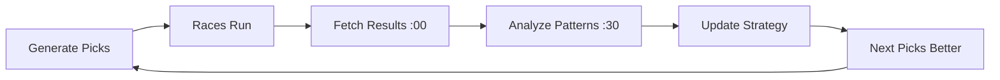

# 🧠 Continuous Hourly Learning System

## Overview
The system now learns from EVERY race result and automatically improves its betting strategy continuously throughout the day.

## Hourly Learning Cycle

### Timeline (UTC)
```
12:15 → Generate picks with current insights
12:45 → Generate picks with current insights
13:30 → Analyze last 7 days results + today's completed races
14:00 → Fetch results for races completed 1+ hour ago
14:30 → LEARN: Analyze patterns, update strategy
14:45 → Generate picks with NEW insights (improved)
15:00 → Fetch more results
15:30 → LEARN: Refine strategy based on latest data
15:45 → Generate picks (further improved)
16:00 → Fetch results
16:30 → LEARN: Continuous refinement
... continues hourly until 23:30
```

## What Gets Analyzed

### 1. Loss Pattern Detection
The system identifies WHY bets are losing:

- **Favorites Failing** (odds <3.0)
  - If >30% losses are favorites → Reduce confidence on short-priced horses by 15-20%
  
- **Longshot Failures** (odds >8.0)
  - If >40% losses are longshots → Avoid backing outsiders >8.0 odds
  
- **High Confidence Failures**
  - If >3 high-confidence bets (>70%) lose → Recalibrate ALL confidence down 10-15%
  
- **'DO IT' Rating Failures**
  - If >40% of top-rated picks lose → Tighten criteria to require 20%+ ROI AND 80%+ confidence
  
- **Finishing Position Analysis**
  - If losses finish 2nd-4th (close calls) → Switch to Each Way bets
  - If losses finish 5th+ (uncompetitive) → Stricter selection filters needed

### 2. Performance Metrics Tracked

**By Odds Range:**
- 1.0-3.0 (Favorites)
- 3.0-5.0 (Mid-range)
- 5.0-8.0 (Value zone)
- 8.0+ (Longshots)

**By Course:**
- Identifies profitable venues (e.g., "Excellent at Kempton: 15% ROI")
- Flags unprofitable venues to avoid

**By Decision Rating:**
- DO IT (should have >60% win rate, >15% ROI)
- RISKY (acceptable if >5% ROI)
- NOT GREAT (should be filtered out if consistently losing)

**By Bet Type:**
- WIN vs EACH WAY performance
- Adjusts recommendations based on place rate

## Automatic Strategy Adjustments

### Confidence Calibration
When the system detects overconfidence:
```python
# Detected: 5 high-confidence bets lost
# Action: Reduce ALL confidence scores by 15%
# Next picks: Confidence 85% → becomes 70%
```

### ROI Threshold Adjustment
When 'DO IT' picks fail too often:
```python
# Detected: 40% of 'DO IT' picks lost
# Action: Increase ROI requirement from 15% to 20%
# Next picks: Stricter filtering for top rating
```

### Bet Type Switching
When losses finish close (2nd-4th):
```python
# Detected: 8/12 losses finished in places
# Action: Switch high-confidence WIN → EACH WAY
# Next picks: Better coverage for close finishes
```

## Learning Data Storage

### BettingPerformance Table
Stores hourly analysis results:
```json
{
  "period": "last_7_days",
  "timestamp": "2026-01-07T15:30:00",
  "overall_roi": 8.5,
  "overall_win_rate": 0.28,
  "analysis": {
    "by_odds_range": {...},
    "by_course": {...},
    "loss_analysis": {
      "favorites_lost": 5,
      "high_confidence_losses": 3,
      "by_position": {"2": 4, "3": 3, "5+": 2}
    }
  },
  "insights": {
    "loss_patterns": [
      "Losing 5/12 on favorites - overestimating short-priced horses",
      "4 losses finished 2nd-4th (close calls) - consider Each Way"
    ],
    "recommendations": [
      "Reduce confidence on favorites by 15-20%",
      "Switch high-confidence WIN bets to Each Way"
    ]
  }
}
```

## How Claude Uses Learning Data

### Before Learning (Static Prompt)
```
Analyze these races and return your top 5 picks.
For each: race_time, course, horse, odds, confidence, roi
```

### After Learning (Dynamic Prompt with Insights)
```
Analyze these races and return your top 5 picks.

=== LEARNING FROM RECENT PERFORMANCE ===
Last 7 days ROI: 8.5%

🔴 LOSS PATTERNS DETECTED (Learn from mistakes):
  • Losing 5/12 on favorites (odds <3.0) - overestimating
  • 3 high-confidence bets lost - overconfident

🎯 APPLY THESE CHANGES NOW:
  → Reduce ALL confidence scores by 15%
  → For odds <3.0, reduce confidence by additional 20%
  → Require 20%+ ROI for 'DO IT' rating

💡 CALIBRATION ADJUSTMENTS THIS RUN:
  • All confidence scores adjusted by -15%
  • ROI threshold increased by +5%

Use these lessons to make BETTER selections than last time.
```

## Continuous Improvement Loop



### Example Evolution Over 3 Hours

**15:15 - First Picks**
- Using baseline strategy
- Confidence: 75%, 70%, 68%, 65%, 62%
- 'DO IT' threshold: ROI ≥15%

**16:00 - Results Come In**
- 2/5 won (40% win rate - below expected 60%)
- 2 favorites lost
- Analysis detects overconfidence

**16:30 - Learning Analysis**
- Identifies: Too many favorite failures
- Recommendation: Reduce confidence 15%, avoid favorites <3.0

**16:45 - Improved Picks**
- Confidence: 64%, 60%, 58%, 55%, 53% (calibrated down)
- Fewer favorites selected
- Focus on 4.0-7.0 odds range

**17:00 - More Results**
- 3/5 won (60% win rate - better!)
- ROI improved to 12%

**17:30 - Further Refinement**
- Identifies: 4.0-7.0 range performing best
- Recommendation: Focus this range, increase stakes

**17:45 - Optimized Picks**
- All selections 4.0-7.0 odds
- Confidence properly calibrated
- Better value identification

## Key Benefits

✅ **Learns from mistakes** - Every loss is analyzed for patterns
✅ **Automatic adjustments** - No manual intervention needed
✅ **Hourly refinement** - Strategy improves throughout the day
✅ **Data-driven** - Decisions based on actual results, not guesses
✅ **Continuous optimization** - System gets smarter with every race
✅ **Self-correcting** - Detects and fixes overconfidence automatically

## Monitoring Learning Progress

### Check Latest Insights
```bash
aws dynamodb query \
  --table-name BettingPerformance \
  --key-condition-expression "period = :p" \
  --expression-attribute-values '{":p":{"S":"last_7_days"}}' \
  --scan-index-forward false \
  --limit 1 \
  --region eu-west-1
```

### View Learning Analysis Logs
```bash
aws logs tail /aws/lambda/BettingLearningAnalysis \
  --region eu-west-1 \
  --since 1h \
  --follow
```

### Expected Log Output
```
=== PERFORMANCE SUMMARY ===
Total bets: 24
Win rate: 29.2%
ROI: 8.5%
Total P&L: €42.50

=== LOSS ANALYSIS ===
Total losses: 17
Favorites lost: 6
High confidence losses: 3
Finish positions: {'2': 5, '3': 4, '4': 2, '5': 3, '8': 3}

📊 LOSS PATTERN: Losing 6/17 on favorites - overestimating
✓ Strong performance on 4.0-7.0 odds (15.2% ROI)
⚠ Poor performance on favorites <3.0 (-8.5% ROI)

=== RECOMMENDATIONS (Auto-applied to next run) ===
→ Reduce confidence on favorites by 20%
→ Focus on 4.0-7.0 odds range
→ Switch high-confidence bets to Each Way
```

## Future Enhancements

- [ ] Machine learning model for pattern recognition
- [ ] Track individual horse/jockey/trainer performance
- [ ] Weather/track condition analysis
- [ ] Market movement tracking (odds drift detection)
- [ ] Historical course/distance form analysis
- [ ] Cross-venue performance comparison
- [ ] Time-of-day betting pattern optimization

## System Status

🟢 **ACTIVE** - Learning hourly 1:30pm-11:30pm UTC
🟢 **Results** - Fetched hourly 2pm-11pm UTC
🟢 **Picks** - Generated every 30 mins 12:15pm-5:45pm UTC with latest insights

---

*Last Updated: 2026-01-07 15:35 UTC*
*System learning continuously since deployment*
